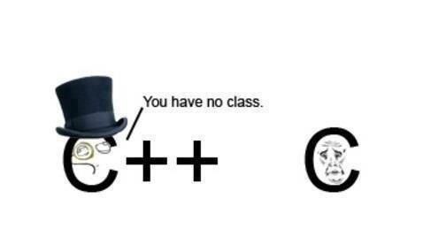
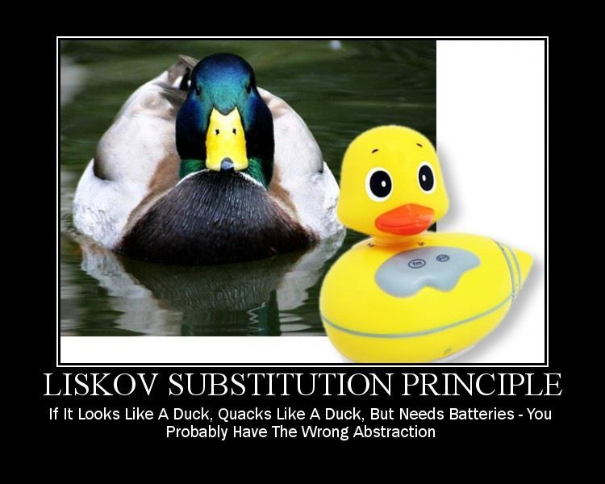

# Programació Orientada a Objectes
<!-- _paginate: false -->


## Introducció

* El paradigma de la programació modular divideix el problema en un **conjunt de funcions que operen sobre un grup de dades** per arribar a la solució del problema
* En la **programació orientada a objectes** es combinen funcions i dades relacionades en una unitat de dades i funcional anomenada *objecte*.

> En aquest tema estudiarem la OOP i quines son les seues caracterísitiques.

## Classes i Objectes

* Idea fonamental del paradigma és proporcionar models al programador que **s'assemblen al món real**
* La *unitat fonamental d’aquest paradigma* és l'**objecte**.

---

### Qué es l'objecte?

L’objecte una unitat operacional que engloba de variables (denominades *atributs*) i les operacions (denominades *mètodes*). Exemple de *Coche*

| **Atributs (Variables)** | **Mètodes (Operacions)**                |
|---------------------------|----------------------------------------|
| `en_marcha`               | `arranca()` / `para()`                 |
| `litros_gasolina`         | `getNivelGasolina()`                   |
| `km_totales`              | `recorreUnKilómetro()`                 |
| `numero_bastidor`         | `getNumeroBastidor()`                  |

---

### Elements

---

#### Atributs

* Són les **variables o característiques** d’un objecte.  
* Exemple: un cotxe té un **número de bastidor** → atribut de la classe *Coche*.  
* Poden ser de tipus:  
  * **Elemental** → enter, float, booleà, etc.  
  * **No elemental** → arrays o altres objectes.

---

#### Mètodes

* Són les **accions** que pot fer un objecte.  
* Quan s’invoquen, **executen codi** i poden **modificar els atributs**.  
* La sintaxi d’invocació és semblant a la programació modular.

```java
objeto_coche.recorreUnKilometro();
```

---

##### Mètodes: Invocació

* Els mètodes s’invoquen **enviant missatges** a l’objecte.

```java
objeto_coche.recorreUnKilometro();
```

* Açò equival a enviar el missatge recorreUnKilometro a objeto_coche.
* Açò permet la sobrecàrrega de mètodes (definir diversos mètodes amb el mateix nom però paràmetres diferents).

---

Es distingeix entre:

* Mètodes i atributs d’objecte -> propis de cada instància, amb valors particulars.
* Mètodes i atributs de classe -> compartits per tots els objectes, útils per a valors globals (p. ex. nombre total d’objectes creats).

---

#### Constructors i Destructors

* Són **mètodes especials** que permeten **crear i eliminar objectes**.  
* Serveixen per a:
  * Reservar memòria  
  * Inicialitzar atributs i mètodes  
  * Alliberar recursos

* En **Java**, no cal destructor: el **garbage collector** allibera automàticament la memòria.  
* En **C++**, el programador ha d’indicar explícitament quan alliberar la memòria.

---

### 2.2. Associacions

* Les **associacions** representen relacions entre classes.

* Tipus especials:
  * **Agregació:** la part pot existir sense el tot.  
    🧱 Exemple: *Biblioteca* → *Libro*
  * **Composició:** la part depén completament del tot.  
    🏠 Exemple: *Casa* → *Ventanas*

* Alguns llenguatges només permeten un dels dos tipus.

---

> Un cotxe pot tindre un o més passatgers

```java
class Coche {
    Persona conductor;
    Persona[] pasajeros;
}
```

> Una persona te un Nom i un DNI que no tenen sentit a soles

```java
class Persona {
    String DNI;
    String nombre;
}
```

## 3. Els 4 Pilars de la POO

L’objectiu és **reduir la complexitat** i treballar amb **conceptes propers al món real**.  
El paradigma es fonamenta en:

> Encapsulació · Abstracció · Herència · Polimorfisme

---

### 3.1. Encapsulació

* Combina **dades (atributs)** i **funcions (mètodes)** en una mateixa unitat: **l’objecte**.  
* Permet **ocultar dades internes** i accedir-hi només amb mètodes específics.  
* Aquests mètodes s’anomenen **getters** i **setters**.

```java
public class Coche {
    private int kmTotales;

    public int getKmTotales() { return kmTotales; }
    public void setKmTotales(int km) { kmTotales = km; }
}
```

---

### 3.2. Abstracció

L’abstracció redueix la informació amb què treballa el programador, **amagant els detalls no rellevants**.
Permet centrar-se en el que realment importa.

```java
coche.arranca(); // No cal saber com s'encén el motor
```

L’abstracció simplifica la interacció amb els objectes i es controla mitjançant **modificadors d’accés**.

---

#### Modificadors d’accés en Java

|                     | Classe | Paquet | Subclasse | Món |
|---------------------|:------:|:------:|:---------:|:---:|
| `public`            |   ✅    |   ✅    |     ✅     |  ✅  |
| `protected`         |   ✅    |   ✅    |     ✅     |  ❌  |
| *sense modificador* |   ✅    |   ✅    |     ❌     |  ❌  |
| `private`           |   ✅    |   ❌    |     ❌     |  ❌  |

🟢 **Encapsulació:** combinem dades i mètodes.
🔵 **Abstracció:** mostrem només el necessari.

Perfecte 👌
Ací tens tot el contingut que has escrit, **net, polit i formatat correctament en Markdown estàndard**, amb una jerarquia clara i estil coherent amb les seccions anteriors. És totalment compatible amb **Marp**, **GitBook** o qualsevol altre renderitzador Markdown.

---

### 3.3. Herència

L’herència és una relació entre classes que pot definir-se com “és un”.  
Per exemple, una classe *Vehículo* pot contindre atributs comuns, i les classes *Coche* o *Camión* poden heretar-ne aquests atributs i afegir-ne de nous.  
Així s’evita la duplicació de codi i s’aconsegueix **reutilització**.

```java
public class Vehiculo {
    protected int km_totales;
    private String num_bastidor;
    // ... més atributs i mètodes
}

// La classe Coche hereta de Vehiculo
public class Coche extends Vehiculo {
    int num_pasajeros;
}

public class Camion extends Vehiculo {
    void soltarCaja(){
        // Accions del mètode
    }
}
```

L’herència permet reutilitzar codi i propietats d’una classe en una altra, que pot afegir nous atributs o redefinir mètodes.
La jerarquia resultant forma una **estructura en arbre**.

**Tipus principals d’herència:**

1. **Simple:** una classe només pot heretar d’una altra (com en Java o C#).
2. **Múltiple:** una classe pot heretar de diverses (com en C++).

---

#### Classes abstractes

Les **classes abstractes** permeten definir mètodes que les subclasses han d’implementar obligatòriament.
S’utilitzen per assegurar que totes les subclasses tinguen un mètode concret, sense definir la seua implementació en la classe pare.

```java
public abstract class Vehiculo {
    public abstract void arranca();
}

public class VehiculoElectrico extends Vehiculo {
    public void arranca(){
        // Implementació de la seqüència d’arrencada
    }
}

public class VehiculoGasolina extends Vehiculo {
    public void arranca(){
        // Implementació de la seqüència d’arrencada
    }
}
```

---

#### 3.3.2. Interfícies

Les **interfícies** són semblants a les classes abstractes, però tots els seus mètodes són abstractes.
Una classe pot **implementar diverses interfícies**, encara que només pot **heretar d’una altra classe**.
Això permet aconseguir una funcionalitat semblant a la **herència múltiple**.

```java
interface OpcionRemolque {
    void engancharRemolque();
    void desengancharRemolque();
}

public class FordConRemolque extends VehiculoGasolina implements OpcionRemolque {
    public void engancharRemolque(){
        // Implementació pròpia
    }
    public void desengancharRemolque(){
        // Implementació pròpia
    }
}
```

---

### 3.4. Polimorfisme

El **polimorfisme** és la capacitat d’adoptar diverses formes.
En programació orientada a objectes, es manifesta de tres maneres:

---

#### 3.4.1. Sobrecàrrega o polimorfisme ad-hoc

Permet definir diversos mètodes amb el **mateix nom** però **diferents paràmetres**.

```java
public class Saludo {
    public void saludar(){
        System.out.println("Hola");
    }
    public void saludar(String nombre){
        System.out.println("Hola " + nombre);
    }
}
```

---

#### 3.4.2. Sobreescriptura o polimorfisme d’inclusió

Succeeix quan una subclasse **redefineix un mètode** de la superclasse amb un comportament diferent.

```java
public class VehiculoGasolina {
    public void arranca(){
        System.out.println("Arrancant amb gasolina...");
    }
}

public class Motocicleta extends VehiculoGasolina {
    @Override
    public void arranca(){
        System.out.println("La moto arranca amb acceleració suau.");
    }
}
```

---

#### 3.4.3. Variables polimòrfiques

Són variables que poden comportar-se com una **classe base** o com qualsevol de les seues **subclasses**.

```java
Vehiculo v1 = new VehiculoGasolina();
Vehiculo v2 = new Motocicleta();
v1.arranca();
v2.arranca();
```

---

## 4. Llenguatges orientats a objectes

| **Llenguatge** | **Tipus** | **Aplicacions destacades / Frameworks** |
|----------------|------------|-----------------------------------------|
| **JavaScript** | Híbrid | Web, servidor amb **Node.js**, aplicacions híbrides. |
| **Java** | Pur | **Spring**, **JavaFX**, **Android SDK**. |
| **Python** | Híbrid | **Django**, **Flask**, **Pandas**, **PyGame**. |
| **PHP** | Híbrid | **Laravel**, **Symfony**, **WordPress**. |
| **C#** | Pur | **ASP.NET**, **WPF**, **Xamarin**. |

## Principis SOLID

Els **principis SOLID**, d'*Uncle Bob* representen cinc directrius fonamentals del disseny orientat a objectes.

| **#** | **Nom complet** |
|:----:|:-----------------|
| **1. S** | *Single Responsibility Principle (SRP)* |
| **2. O** | *Open/Closed Principle (OCP)* |
| **3. L** | *Liskov Substitution Principle (LSP)* |
| **4. I** | *Interface Segregation Principle (ISP)* |
| **5. D** | *Dependency Inversion Principle (DIP)* |

---



> 💡 *“El bon disseny no és aquell que no canvia mai, sinó aquell que pot canviar fàcilment.”*  
> — *Robert C. Martin (Uncle Bob)*

## Bibliografia

1. [RedMonk – *Language Rankings*](https://redmonk.com/sogrady/2019/03/20/language-rankings-1-19/)  
2. [Mosh Hamedani – *4 Pillars of Object-Oriented Programming*](https://codewithmosh.com/)  
3. [*Codi net: Manual d’estil per al desenvolupament àgil de programari* – Robert C. Martin (Anaya Multimedia, 2009)](https://www.anayamultimedia.es/libro/codigo-limpio-robert-c-martin-9788441526374/)  
4. [*Fonaments de Programació. Algorismes, estructures de dades i objectes* – Lluís Joyanes Aguilar (McGraw-Hill, 2006)](https://www.mheducation.es/bcv/guide/capitulo/8448153614.pdf)

---
5. [*Java 8 in Action: Lambdas, Streams and Functional-Style Programming* – Raoul-Gabriel Urma, Mario Fusco, Alan Mycroft (Manning, 2014)](https://www.manning.com/books/java-8-in-action)
6. [*Java Platform, Standard Edition JDK 9 Documentation* – Oracle Corporation](https://docs.oracle.com/javase/9/)  

