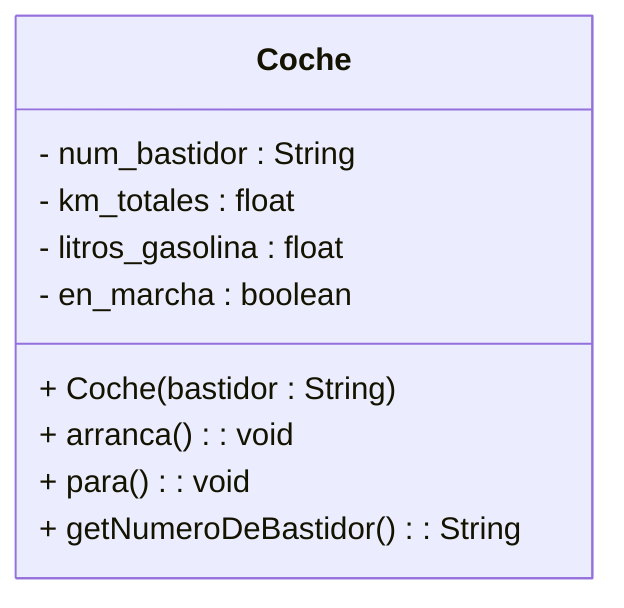

# 2. Classes i Objectes

En la programació orientada a objectes, una **classe** és un *model o plantilla* que defineix les **característiques** (atributs) i **comportaments** (mètodes) dels objectes que se’n creen.  
Cada **objecte** és una instància concreta d’aquesta classe, amb valors propis per als seus atributs i capacitat per executar les seues operacions.

---

## 2.1. Exemple introductori

Considerem l’exemple d’un **cotxe**.  
Cada cotxe té atributs com el número de bastidor, els quilòmetres totals recorreguts o la quantitat de gasolina.  
També realitza accions com arrancar, parar o informar del nivell de gasolina.

```java
public class Coche {
    String num_bastidor;
    float km_totales;
    float litros_gasolina;
    boolean en_marcha;

    // Constructor
    Coche(String bastidor){
        num_bastidor = bastidor;
        km_totales = 0;
        litros_gasolina = 0;
        en_marcha = false;
    }

    // Mètodes
    void arranca(){ en_marcha = true; }
    void para(){ en_marcha = false; }
    String getNumeroDeBastidor(){ return num_bastidor; }
}
```

Cada objecte d’aquesta classe (*per exemple, dos cotxes diferents*) tindrà el seu propi estat intern.  
Això permet que el programa gestione múltiples instàncies independents de la mateixa classe.

---

## 2.2. Atributs

Els **atributs** representen les dades que descriuen l’estat intern d’un objecte.  
Poden ser de tipus:

* **Elemental o primitiu**, com `int`, `float`, `boolean`, `char`, etc.  
* **No elemental o complex**, com altres classes (`Persona`, `Motor`, `Ventana`...).

En l’exemple anterior, `km_totales`, `litros_gasolina` i `en_marcha` són atributs elementals, mentre que podríem afegir-ne d’altres no elementals, com ara `Motor motorPrincipal` o `Persona conductor`.

```java
class Coche {
    Motor motorPrincipal;
    Persona conductor;
}
```

### Atributs d’objecte i atributs de classe

* **Atributs d’objecte:** cada instància en té una còpia pròpia.  
  Ex.: `km_totales` o `litros_gasolina`.
* **Atributs de classe:** es comparteixen entre totes les instàncies.  
  En Java, es declaren amb la paraula clau `static`.

```java
class Coche {
    static int totalCochesFabricados = 0; // atribut de classe
    String num_bastidor;                   // atribut d’objecte

    Coche(String bastidor){
        num_bastidor = bastidor;
        totalCochesFabricados++;
    }
}
```

---

## 2.3. Mètodes

Els **mètodes** defineixen les accions o comportaments de la classe.  
Permeten modificar o consultar l’estat dels objectes.

L’accés als mètodes es fa mitjançant **l’enviament de missatges**:  
```java
miCoche.arranca();
miCoche.getNumeroDeBastidor();
```

### Tipus de mètodes

* **Mètodes d’objecte:** operen sobre les dades particulars d’una instància.  
* **Mètodes de classe:** operen a nivell global, i s’accedix sense instanciar cap objecte (`NomClasse.mètode()`).

```java
class Coche {
    static int totalCoches;
    void arranca(){ /* ... */ }
    static void mostrarTotales(){
        System.out.println("S'han fabricat " + totalCoches + " cotxes.");
    }
}
```

---

## 2.4. Constructors i Destructors

Els **constructors** són mètodes especials que inicialitzen els objectes en el moment de la seua creació.  
Tenen el mateix nom que la classe i **no retornen valor**.

```java
Coche miCoche = new Coche("XF567GH9");
```

En llenguatges com Java, no és necessari definir **destructors** manuals, ja que el **garbage collector** s’encarrega automàticament de recuperar la memòria d’objectes no utilitzats.  
En altres llenguatges (com C++), sí que existeix un destructor explícit per gestionar la destrucció i alliberament de recursos.

---

## 2.5. Diagrama conceptual



Aquest diagrama UML representa visualment la definició de la classe `Coche`, mostrant atributs i mètodes amb els seus tipus i visibilitat.

---

## 2.6. Objectes i instàncies

Crear un objecte vol dir generar una **instància d’una classe**:

```java
Coche cocheDeJuan = new Coche("BAS-1324");
Coche cocheDeAna  = new Coche("CDE-7568");

cocheDeJuan.arranca();
cocheDeAna.para();
```

Cada objecte manté el seu propi conjunt de valors interns.  
Encara que els dos siguen del mateix tipus `Coche`, són entitats independents amb estats distints.

---

## 2.7. Exemple ampliat amb interacció

```java
public class Coche {
    String num_bastidor;
    float km_totales;
    float litros_gasolina;
    boolean en_marcha;

    Coche(String bastidor){
        num_bastidor = bastidor;
        km_totales = 0;
        litros_gasolina = 10;
        en_marcha = false;
    }

    void arranca(){
        if(litros_gasolina > 0){
            en_marcha = true;
            System.out.println("El cotxe ha arrencat.");
        } else {
            System.out.println("No hi ha gasolina suficient!");
        }
    }

    void conducir(float km){
        if(en_marcha){
            km_totales += km;
            litros_gasolina -= km * 0.1;
        } else {
            System.out.println("Has d’arrancar el cotxe abans de conduir!");
        }
    }

    void parar(){ en_marcha = false; }

    String getNumeroDeBastidor(){ return num_bastidor; }

    float getNivelGasolina(){ return litros_gasolina; }
}
```

Aquest fragment mostra un comportament més complet: el cotxe necessita gasolina per arrancar, consumeix combustible quan circula, i pot consultar el nivell restant.

---

## 2.8. Resum

| Concepte              | Descripció                                | Exemple                              |
|-----------------------|-------------------------------------------|--------------------------------------|
| **Classe**            | Plantilla que defineix atributs i mètodes | `class Coche { ... }`                |
| **Objecte**           | Instància d’una classe                    | `Coche miCoche = new Coche("A123");` |
| **Atribut**           | Dada que descriu l’estat de l’objecte     | `km_totales`, `litros_gasolina`      |
| **Mètode**            | Acció que pot realitzar l’objecte         | `arranca()`, `para()`                |
| **Constructor**       | Inicialitza un objecte nou                | `new Coche("B456")`                  |
| **Garbage Collector** | Gestor automàtic de memòria en Java       | S’executa de manera interna          |

---

## 2.9. Reflexió final

La separació entre **dades (atributs)** i **accions (mètodes)** dins d’una mateixa entitat millora la coherència i redueix els errors per acoblament.  
La classe proporciona el **model** i els objectes aporten la **vida** dins del programa, creant un conjunt organitzat i flexible.

> *"Una classe és la idea; l’objecte és la seua manifestació."*
